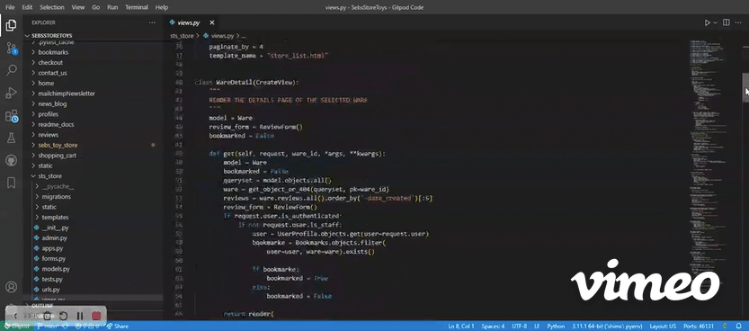

### Hi there 👋

I am **Ivette Mc Dermott**. Just completed the Full Stack Developer Diploma with e-commerce specialization with Code Institute.

🔭 I’m currently working on improve the skills I had adquire with CI for full stack developer  
🌱 I’m currently learning Django, while keep studying Js and Python.  
👯 I’m looking to collaborate on any project that allows me to grow as coder :) I had some experience with Git and collaborative projects but lots to learn yet and open to always!  
<!-- - 🤔 I’m looking for help with Django -->
💬 Ask me about anything about code, I love to share ideas and rubber duck.  
📫 How to reach me: (https://www.linkedin.com/in/ivette-mc-dermott/)  
😄 Pronouns: She/Her  
<!-- - ⚡ Fun fact: -->

1️⃣  Some of my projects through the course and the tech was used for

| Project       | Tech           |
| ------------- |:-------------:|
| PP1    | HTML, CSS |
| PP2   | HTML, CSS, JS |
| PP3    | PYTHON |
| PP4    | HTML, CSS, DJANGO, BOOTSTRAP, JS, CLOUDINARY, SQL ELEPHANT |
| PP5    | HTML, CSS, DJANGO, BOOTSTRAP, JS, CLOUDINARY, SQL ELEPHANT, STRIPE |
| HACKATHON - MUSIC    | HTML, CSS, JS |
| HACKATHON - RISING WOMAN    | HTML, CSS, DJANGO, BOOTSTRAP, JS, CLOUDINARY, SQL ELEPHANT |

2️⃣  What roles are we aiming to achieve

| Job position| Needed| Desired  |
| ------------- |:-------------:| -----:|
| Full Stack | Django, HTML, CSS, JS, SQL | React |

3️⃣ What we have and what we’re missing 

| Skill  | status |
| ------------- | ------------- |
| HTML | Done 🤓  |
| CSS | In process 🙃  |
| JS  | In process 🙃  |
| PYTHON | In process 🙃  |
| DJANGO | In process 🙃  |
| REACT | Starting 🙃  |
| AWS  | In process 🙃 |
| SQL | In process 🙃  |
